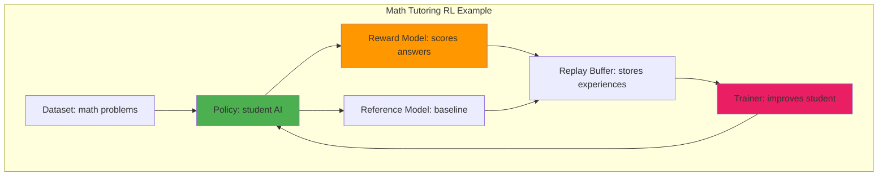
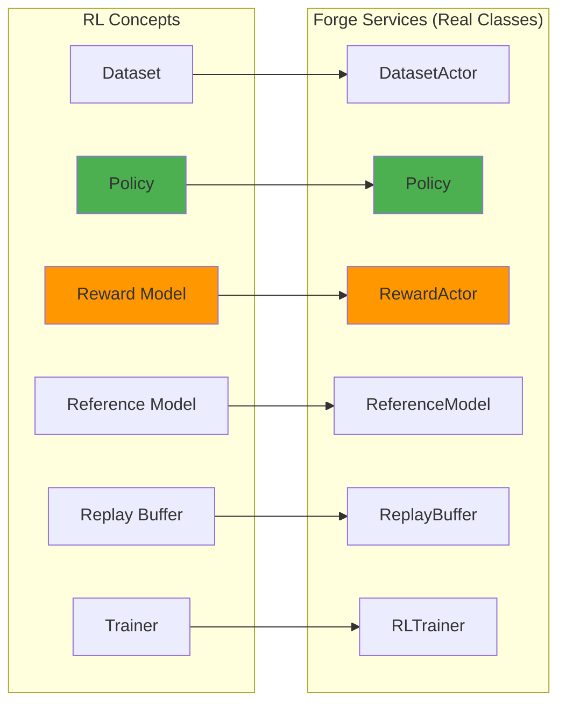
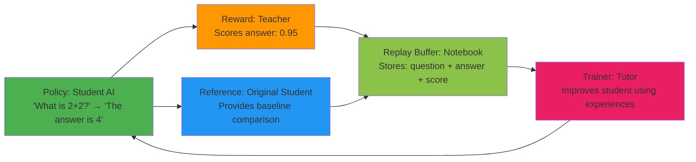

# Part 1: RL Fundamentals - Using Forge Terminology

## Core RL Components in Forge

Let's start with a simple math tutoring example to understand RL concepts with the exact names Forge uses:

### The Toy Example: Teaching Math



### RL Components Defined (Forge Names)

1. **Dataset**: Provides questions/prompts (like "What is 2+2?")
2. **Policy**: The AI being trained (generates answers like "The answer is 4")
3. **Reward Model**: Evaluates answer quality (gives scores like 0.95)
4. **Reference Model**: Original policy copy (prevents drift from baseline)
5. **Replay Buffer**: Stores experiences (question + answer + score)
6. **Trainer**: Updates the policy weights based on experiences

### The RL Learning Flow

```python
# CONCEPTUAL EXAMPLE - see apps/grpo/main.py for GRPO Code

def conceptual_rl_step():
    # 1. Get a math problem
    question = dataset.sample()  # "What is 2+2?"

    # 2. Student generates answer
    answer = policy.generate(question)  # "The answer is 4"

    # 3. Teacher grades it
    score = reward_model.evaluate(question, answer)  # 0.95

    # 4. Compare to original student
    baseline = reference_model.compute_logprobs(question, answer)

    # 5. Store the experience
    experience = Episode(question, answer, score, baseline)
    replay_buffer.add(experience)

    # 6. When enough experiences collected, improve student
    batch = replay_buffer.sample(curr_policy_version=0)
    if batch is not None:
        trainer.train_step(batch)  # Student gets better!

# 🔄 See complete working example below with actual Forge service calls
```

## From Concepts to Forge Services

Here's the key insight: **Each RL component becomes a Forge service**. The toy example above maps directly to Forge:



### RL Step with Forge Services

Let's look at the example from above again, but this time we would use the names from Forge:

```python
# Conceptual Example

async def conceptual_forge_rl_step(services, step):
    # 1. Get a math problem - Using actual DatasetActor API
    sample = await services['dataloader'].sample.call_one()
    question, target = sample["request"], sample["target"]

    # 2. Student generates answer - Using actual Policy API
    responses = await services['policy'].generate.route(prompt=question)
    answer = responses[0].text

    # 3. Teacher grades it - Using actual RewardActor API
    score = await services['reward_actor'].evaluate_response.route(
        prompt=question, response=answer, target=target
    )

    # 4. Compare to baseline - Using actual ReferenceModel API
    # Note: ReferenceModel.forward requires input_ids, max_req_tokens, return_logprobs
    ref_logprobs = await services['ref_model'].forward.route(
        input_ids, max_req_tokens, return_logprobs=True
    )

    # 5. Store experience - Using actual Episode structure from apps/grpo/main.py
    episode = create_episode_from_response(responses[0], score, ref_logprobs, step)
    await services['replay_buffer'].add.call_one(episode)

    # 6. Improve student - Using actual training pattern
    batch = await services['replay_buffer'].sample.call_one(
        curr_policy_version=step
    )
    if batch is not None:
        inputs, targets = batch
        loss = await services['trainer'].train_step.call(inputs, targets)
        return loss
```

**Key difference**: Same RL logic, but each component is now a distributed, fault-tolerant, auto-scaling service.

Did you realise-we are not worrying about any Infra code here! Forge Automagically handles the details behind the scenes and you can focus on writing your RL Algorthms!


## Why This Matters: Traditional ML Infrastructure Fails

### The Infrastructure Challenge

Our simple RL loop above has complex requirements:

#### Problem 1: Different Resource Needs

| Component | Resource Needs | Scaling Strategy |
|-----------|----------------|------------------|
| **Policy** (Student AI) | Large GPU memory | Multiple replicas for throughput |
| **Reward Heuristic** (Teacher) | Small compute | CPU or small GPU |
| **Trainer** (Tutor) | Massive GPU compute | Distributed training |
| **Dataset** (Question Bank) | CPU intensive I/O | High memory bandwidth |

### Problem 2: Complex Interdependencies



Each step has different:
- **Latency requirements**: Policy inference needs low latency (each episode waits), training can batch multiple episodes together
- **Scaling patterns**: Need N policy replicas to keep trainer busy, plus different sharding strategies (tensor parallel for training vs replicated inference)
- **Failure modes**: Any component failure cascades to halt the entire pipeline (Forge prevents this with automatic failover)
- **Resource utilization**: GPUs for inference/training, CPUs for data processing

### Problem 3: The Coordination Challenge

Unlike supervised learning where you process independent batches, RL requires coordination:

```python
# While this does work, it creates bottlenecks and resource waste
def naive_rl_step():
    # Policy waits idle while reward model works
    response = policy_model.generate(prompt)  # GPU busy
    reward = reward_model.evaluate(prompt, response)  # Policy GPU idle

    # Training waits for single episode
    loss = compute_loss(response, reward)  # Batch size = 1, inefficient

    # Everything stops if any component fails
    if policy_fails or reward_fails or trainer_fails:
        entire_system_stops()
```

## Enter Forge: RL-Native Architecture

Forge solves these problems by treating each RL component as an **independent, distributed unit** - some as fault-tolerant services (like Policy inference where failures are easy to handle), others as actors (like Trainers where recovery semantics differ)

Let's see how core RL concepts map to Forge components (you'll notice a mix of `.route()` for services and `.call_one()` for actors - we cover when to use each in Part 2):

**Quick API Reference:** (covered in detail in Part 2: Service Communication Patterns)
- `.route()` - Send request to any healthy replica in a service (load balanced)
- `.call_one()` - Send request to a single actor instance
- `.fanout()` - Send request to ALL replicas in a service

```python
async def real_rl_training_step(services, step):
    """Single RL step using verified Forge APIs"""

    # 1. Environment interaction - Using actual DatasetActor API
    sample = await services['dataloader'].sample.call_one()
    prompt, target = sample["request"], sample["target"]

    responses = await services['policy'].generate.route(prompt)

    # 2. Reward computation - Using actual RewardActor API
    score = await services['reward_actor'].evaluate_response.route(
        prompt=prompt, response=responses[0].text, target=target
    )

    # 3. Get reference logprobs - Using actual ReferenceModel API
    # Note: ReferenceModel requires full input_ids tensor, not just tokens
    input_ids = torch.cat([responses[0].prompt_ids, responses[0].token_ids])
    ref_logprobs = await services['ref_model'].forward.route(
        input_ids.unsqueeze(0), max_req_tokens=512, return_logprobs=True
    )

    # 4. Experience storage - Using actual Episode pattern from GRPO
    episode = create_episode_from_response(responses[0], score, ref_logprobs, step)
    await services['replay_buffer'].add.call_one(episode)

    # 5. Learning - Using actual trainer pattern
    batch = await services['replay_buffer'].sample.call_one(
        curr_policy_version=step
    )
    if batch is not None:
        inputs, targets = batch  # GRPO returns (inputs, targets) tuple
        loss = await services['trainer'].train_step.call(inputs, targets)

        # 6. Policy synchronization - Using actual weight update pattern
        await services['trainer'].push_weights.call(step + 1)
        await services['policy'].update_weights.fanout(step + 1)

        return loss
```

**Key insight**: Each line of RL pseudocode becomes a service call. The complexity of distribution, scaling, and fault tolerance is hidden behind these simple interfaces.

## What Makes This Powerful

### Automatic Resource Management
```python
responses = await policy.generate.route(prompt=question)
answer = responses[0].text  # responses is list[Completion]
```

Forge handles behind the scenes:
- Routing to least loaded replica
- GPU memory management
- Batch optimization
- Failure recovery
- Auto-scaling based on demand

### Independent Scaling
```python

from forge.actors.policy import Policy
from forge.actors.replay_buffer import ReplayBuffer
from forge.actors.reference_model import ReferenceModel
from forge.actors.trainer import RLTrainer
from apps.grpo.main import DatasetActor, RewardActor, ComputeAdvantages
from forge.data.rewards import MathReward, ThinkingReward
import asyncio
import torch

model = "Qwen/Qwen3-1.7B"
group_size = 1

(
    dataloader,
    policy,
    trainer,
    replay_buffer,
    compute_advantages,
    ref_model,
    reward_actor,
) = await asyncio.gather(
        # Dataset actor (CPU)
        DatasetActor.options(procs=1).as_actor(
            path="openai/gsm8k",
            revision="main",
            data_split="train",
            streaming=True,
            model=model,
        ),
        # Policy service with GPU
        Policy.options(procs=1, with_gpus=True, num_replicas=1).as_service(
            engine_config={
                "model": model,
                "tensor_parallel_size": 1,
                "pipeline_parallel_size": 1,
                "enforce_eager": False
            },
            sampling_config={
                "n": group_size,
                "max_tokens": 16,
                "temperature": 1.0,
                "top_p": 1.0
            }
        ),
        # Trainer actor with GPU
        RLTrainer.options(procs=1, with_gpus=True).as_actor(
            # Trainer config would come from YAML in real usage
            model={"name": "qwen3", "flavor": "1.7B", "hf_assets_path": f"hf://{model}"},
            optimizer={"name": "AdamW", "lr": 1e-5},
            training={"local_batch_size": 2, "seq_len": 2048}
        ),
        # Replay buffer (CPU)
        ReplayBuffer.options(procs=1).as_actor(
            batch_size=2,
            max_policy_age=1,
            dp_size=1
        ),
        # Advantage computation (CPU)
        ComputeAdvantages.options(procs=1).as_actor(),
        # Reference model with GPU
        ReferenceModel.options(procs=1, with_gpus=True).as_actor(
            model={"name": "qwen3", "flavor": "1.7B", "hf_assets_path": f"hf://{model}"},
            training={"dtype": "bfloat16"}
        ),
        # Reward actor (CPU)
        RewardActor.options(procs=1, num_replicas=1).as_service(
            reward_functions=[MathReward(), ThinkingReward()]
        )
    )
```

**Forge Components: Services vs Actors**

Forge has two types of distributed components:
- **Services**: Multiple replicas with automatic load balancing (like Policy, RewardActor)
- **Actors**: Single instances that handle their own internal distribution (like RLTrainer, ReplayBuffer)

We cover this distinction in detail in Part 2, but for now this explains the scaling patterns:
- Policy service: num_replicas=8 for high inference demand
- RewardActor service: num_replicas=16 for parallel evaluation
- RLTrainer actor: Single instance with internal distributed training


### Fault Tolerance
```python
# If a policy replica fails:
responses = await policy.generate.route(prompt=question)
answer = responses[0].text
# -> Forge automatically routes to healthy replica
# -> Failed replica respawns in background
# -> No impact on training loop

# If reward service fails:
score = await reward_actor.evaluate_response.route(
    prompt=question, response=answer, target=target
)
```

- Retries on different replica automatically
- Graceful degradation if all replicas fail
- System continues (may need application-level handling)

This is fundamentally different from monolithic RL implementations where any component failure stops everything!

In the next Section, we will go a layer deeper and learn how ForgeServices work. Continue to [Part 2 here](./2_Forge_Internals.MD)
