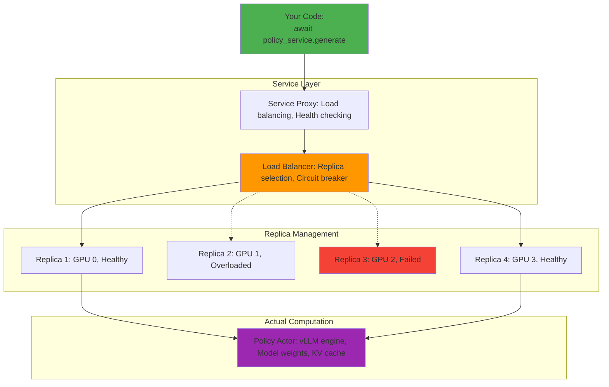
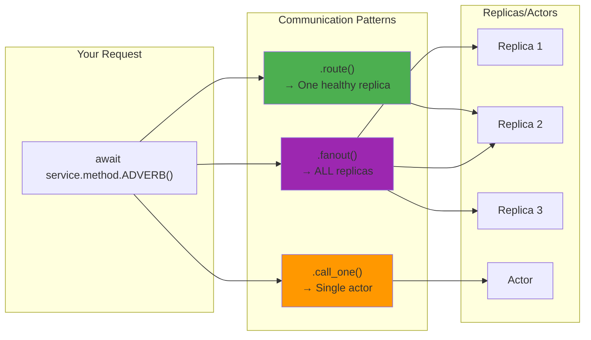

# Part 2: Peeling Back the Abstraction - What Are Services?

We highly recommend reading [Part 1](./1_RL_and_Forge_Fundamentals.MD) before this, it explains RL Concepts and how they land in Forge.

Now that you see the power of the service abstraction, let's understand what's actually happening under the hood, Grab your chai!

## Service Anatomy: Beyond the Interface

When you call `await policy_service.generate(question)`, here's what actually happens:

(Don't worry, we will understand Services right in the next section!)



## Service Components Deep Dive

### 1. Real Service Configuration

Here's the actual ServiceConfig from Forge source code:

```python
# Configuration pattern from apps/grpo/main.py:
Policy.options(
    procs=1,           # Processes per replica
    num_replicas=4,    # Number of replicas
    with_gpus=True     # Allocate GPUs
    # Other available options:
    # hosts=None   #  the number of remote hosts used per replica
)
```

### 2. Real Service Creation

Services are created using the `.options().as_service()` pattern from the actual GRPO implementation:

The service creation automatically handles:
- Spawning actor replicas across processes/GPUs
- Load balancing with .route() method for services
- Health monitoring and failure recovery
- Message routing and serialization

```python
from forge.actors.policy import Policy

model = "Qwen/Qwen3-1.7B"

policy = await Policy.options(
    procs=1,
    with_gpus=True,
    num_replicas=1
).as_service(
    engine_config={
        "model": model,
        "tensor_parallel_size": 1,
        "pipeline_parallel_size": 1,
        "enforce_eager": False
    },
    sampling_config={
        "n": 1,
        "max_tokens": 16,
        "temperature": 1.0,
        "top_p": 1.0
    }
)

prompt = "What is 3 + 5?"
responses = await policy.generate.route(prompt)
print(f"Response: {responses[0].text}")

# Cleanup when done
await policy.shutdown()
```

### 3. How Services Actually Work

Forge services are implemented as ServiceActors that manage collections of your ForgeActor replicas:

When you call `.as_service()`, Forge creates a `ServiceInterface` that manages N replicas of your `ForgeActor` class and gives you methods like `.route()`, `.fanout()`, etc.

```python
# Your code sees this simple interface:
responses = await policy.generate.route(prompt=prompt)
# But Forge handles all the complexity of replica management, load balancing, and fault tolerance
```

## Communication Patterns: Quick Reference

**API Summary:**
- `.route()` - Send request to any healthy replica in a service (load balanced)
- `.call_one()` - Send request to a single actor instance
- `.fanout()` - Send request to ALL replicas in a service



## Deep Dive: Service Communication Patterns

These communication patterns (\"adverbs\") determine how your service calls are routed to replicas. Understanding when to use each pattern is key to effective Forge usage.

### 1. `.route()` - Load Balanced Single Replica

**When to use**: Normal request routing where any replica can handle the request.

```python
responses = await policy.generate.route(prompt=question)
answer = responses[0].text  # Extract text from Completion object
```

Behind the scenes:
1. Health check eliminates failed replicas
2. Load balancer picks replica (currently round robin, configurable balancers coming soon)
3. Request routes to that specific replica
4. Automatic retry on different replica if failure

**Performance characteristics**:
- **Latency**: Lowest (single network hop)
- **Throughput**: Limited by single replica capacity
- **Fault tolerance**: Automatic failover to other replicas

**Critical insight**: `.route()` is your default choice for stateless operations in Forge services.

### 2. `.fanout()` - Broadcast with Results Collection

**When to use**: You need responses from ALL replicas.

```python
# Get version from all policy replicas
current_versions = await policy.get_version.fanout()
# Returns: [version_replica_1, version_replica_2, ...]

# Update weights on all replicas
await policy.update_weights.fanout(new_policy_version)
# Broadcasts to all replicas simultaneously
```

**Performance characteristics**:
- **Latency**: Slowest replica determines total latency
- **Throughput**: Network bandwidth × number of replicas
- **Fault tolerance**: Fails if ANY replica fails (unless configured otherwise)

**Critical gotcha**: Don't use `.fanout()` for high-frequency operations - it contacts all replicas.

### 3. Streaming Operations - Custom Implementation Pattern

**When to use**: You want to process results as they arrive, not wait for all.

```python
# CONCEPTUAL - Streaming requires custom implementation in your training loop
# The basic ReplayBuffer doesn't have built-in streaming methods
# Pattern from apps/grpo/main.py continuous training:

while training:
    # This is the real API call pattern
    batch = await replay_buffer.sample.call_one(curr_policy_version=step)
    if batch is not None:
        # Process batch immediately
        loss = await trainer.train_step.call_one(batch)
        print(f"Training loss: {loss}")
    else:
        await asyncio.sleep(0.1)  # Wait for more data
```

**Performance characteristics**:
- **Latency**: Process first result immediately
- **Throughput**: Non-blocking async operations (much higher than waiting for full batches)
- **Fault tolerance**: Continues if some replicas fail

**Critical insight**: This is essential for high-throughput RL where you can't wait for batches.

### 3. Service Sessions for Stateful Operations

**When to use**: When you need multiple calls to hit the same replica (like KV cache preservation).

**What are sticky sessions?** A session ensures all your service calls within the `async with` block go to the same replica, instead of being load-balanced across different replicas.

```python
# This Counter example demonstrates the difference between regular routing and sessions

from forge.controller import ForgeActor
from monarch.actor import endpoint

class ForgeCounter(ForgeActor):
    def __init__(self, initial_value: int):
        self.value = initial_value

    @endpoint
    def increment(self) -> int:
        self.value += 1
        return self.value

    @endpoint
    def get_value(self) -> int:
        return self.value

    @endpoint
    async def reset(self):
        self.value = 0

counter_service = await ForgeCounter.options(
    procs=1, num_replicas=4
).as_service(initial_value=0)

# WITHOUT SESSIONS: Each .route() call goes to a different replica
await counter_service.increment.route()  # Might go to replica 2
await counter_service.increment.route()  # Might go to replica 1
await counter_service.increment.route()  # Might go to replica 3

results = await counter_service.increment.fanout()  # Get from all replicas
print(f"All replica values: {results}")
# Output: All replica values: [1, 2, 1, 1] - Each replica has different state!
```

The problem: each `.route()` call can go to different replicas, creating inconsistent state.

```python
# WITH SESSIONS: All calls go to the SAME replica
print("\nUsing sticky sessions:")
async with counter_service.session():  # Creates a session that picks one replica
    await counter_service.reset.route()  # Uses .route() within session
    print(await counter_service.increment.route())  # 1
    print(await counter_service.increment.route())  # 2
    print(await counter_service.increment.route())  # 3

    final_value = await counter_service.get_value.route()
    print(f"Final value on this replica: {final_value}")  # 3

# Output:
# Using sticky sessions:
# 1
# 2
# 3
# Final value on this replica: 3

# Same pattern works with Policy for multi-turn conversations:
# async with policy.session():
#     response1 = await policy.generate.route(turn1)
#     full_prompt = turn1 + response1[0].text + turn2
#     response2 = await policy.generate.route(full_prompt)
#     # Both calls hit same replica, preserving KV cache

# Cleanup
await counter_service.shutdown()
```

**Performance impact**: Critical for maintaining KV cache in multi-turn conversations.

## Deep Dive: State Management Reality

The most complex challenge in distributed RL is maintaining state consistency while maximizing performance.

### The KV Cache Problem

**The challenge**: Policy inference is much faster with KV cache, but cache is tied to specific conversation history.

```python
# This breaks KV cache optimization:
async def naive_multi_turn():
    # Each call might go to different replica = cache miss
    response1 = await policy_service.generate.choose(question1)
    response2 = await policy_service.generate.choose(question1 + response1) # Cache miss!
    response3 = await policy_service.generate.choose(conversation_so_far)   # Cache miss!
```

**The solution**: Sticky sessions ensure all calls go to same replica.

```python
async def optimized_multi_turn():
    async with policy.session():
        # All calls guaranteed to hit same replica = cache hits
        response1 = await policy.generate.route(prompt=question1)
        full_prompt = question1 + response1[0].text
        response2 = await policy.generate.route(prompt=full_prompt) # Cache hit!
        conversation = full_prompt + response2[0].text
        response3 = await policy.generate.route(prompt=conversation)   # Cache hit!

    # Session ends, replica can be garbage collected or reused
```

**Performance impact**: Maintaining KV cache across turns avoids recomputing previous tokens.

### Replay Buffer Consistency

**The challenge**: Multiple trainers and experience collectors reading/writing concurrently.

**Real Forge approach**: The ReplayBuffer actor handles concurrency internally:

```python
# Forge ReplayBuffer endpoints (verified from source code)
# Add episodes (thread-safe by actor model)
await replay_buffer.add.call_one(episode)  # .choose() would work too, but .call_one() clarifies it's a singleton actor not ActorMesh

# Sample batches for training
batch = await replay_buffer.sample.call_one(
    curr_policy_version=step_number,
    batch_size=None  # Optional parameter, uses default from config
)

# Additional methods available:
# await replay_buffer.clear.call_one()  # Clear buffer
# await replay_buffer.evict.call_one(curr_policy_version)  # Remove old episodes
# state = await replay_buffer.state_dict.call_one()  # Get state for checkpointing
```

**Critical insight**: The actor model provides natural thread safety - each actor processes messages sequentially.

### Weight Synchronization Strategy

**The challenge**: Trainer updates policy weights, but policy service needs those weights.

```python
# Forge weight synchronization pattern from apps/grpo/main.py
async def real_weight_sync(trainer, policy, step):
    # Trainer pushes weights to TorchStore with version number
    await trainer.push_weights.call_one(policy_version=step + 1)

    # Policy service updates to new version from TorchStore
    # Use .fanout() to update ALL policy replicas
    await policy.update_weights.fanout(policy_version=step + 1)

# Check current policy version
current_version = await policy.get_version.route()
print(f"Current policy version: {current_version}")
```

## Deep Dive: Asynchronous Coordination Patterns

**The real challenge**: Different services run at different speeds, but Forge's service abstraction handles the coordination complexity.

### The Forge Approach: Let Services Handle Coordination

Instead of manual coordination, Forge services handle speed mismatches automatically:

```python
from apps.grpo.main import Episode, Group

async def simple_rl_step():

    # ===== Generate a rollout =====
    sample = await dataloader.sample.call_one()  # DatasetActor is an actor, not service
    prompt, target = sample["request"], sample["target"]  # Correct field names

    print(f"Prompt: {prompt}")
    print(f"Target: {target}")

    actions = await policy.generate.route(prompt=prompt)  # Policy is a service
    print(f"Policy response: {actions[0].text}")

    # Create input tensor for reference model (requires full context)
    input_ids = torch.cat([actions[0].prompt_ids, actions[0].token_ids])
    ref_logprobs = await ref_model.forward.route(
        input_ids.unsqueeze(0), max_req_tokens=512, return_logprobs=True
    )
    reward = await reward_actor.evaluate_response.route(  # RewardActor is a service
        prompt=prompt,
        response=actions[0].text,
        target=target
    )
    print(f"Reward: {reward}")

    # Create episode using actual GRPO Episode structure
    episode = Episode(
        episode_id="0",
        request=prompt,
        policy_version=0,
        pad_id=tokenizer.pad_token_id,
        request_len=512,
        response_len=512,
        target=target
    )

    # Add response data
    episode.response = actions[0].text
    episode.request_tokens = actions[0].prompt_ids.tolist()
    episode.response_tokens = actions[0].token_ids.tolist()
    episode.ref_logprobs = ref_logprobs[0]  # Extract from batch dimension
    episode.reward = reward

    # Compute advantages using actual ComputeAdvantages actor
    group = Group.new_group(0, 1, prompt, 0, tokenizer.pad_token_id, 512, 512, target)
    group.episodes[0] = episode
    advantages = await compute_advantages.compute.call_one(group)  # ComputeAdvantages is an actor
    episode.advantage = advantages[0]
    print(f"Advantage: {advantages[0]}")
    await replay_buffer.add.call_one(episode)  # ReplayBuffer is an actor
    print("Episode stored in replay buffer")

    # ===== Train on the batch =====
    batch = await replay_buffer.sample.call_one(curr_policy_version=0)
    if batch is not None:
        print("Training on batch...")
        inputs, targets = batch  # GRPO returns (inputs, targets) tuple
        loss = await trainer.train_step.call(inputs, targets)  # RLTrainer is an actor
        print(f"Training loss: {loss}")
        return loss
    else:
        print("Not enough data in buffer yet")
        return None

# Note: This simplified example assumes tokenizer and services are already initialized
for step in range(10):
    print(f"\n--- RL Step {step + 1} ---")
    loss = await simple_rl_step()
    if loss:
        print(f"Step {step + 1} complete, loss: {loss:.4f}")
    else:
        print(f"Step {step + 1} complete, building buffer...")
```

### Handling Speed Mismatches with Service Scaling

**The insight**: Scale services independently based on their bottlenecks.

```python
# Scale fast services with more replicas
policy = await Policy.options(
    procs=1, num_replicas=8, with_gpus=True  # Many replicas for high throughput
).as_service(
    engine_config={"model": model_name, "tensor_parallel_size": 1}
)

# Reward evaluation might be CPU-bound
reward_actor = await RewardActor.options(
    procs=1, num_replicas=16, with_gpus=False  # More CPU replicas
).as_service(
    reward_functions=[MathReward()]
)

# Training needs fewer but more powerful replicas
trainer = await RLTrainer.options(
    procs=1, with_gpus=True  # Fewer but GPU-heavy
).as_actor(  # Trainer typically uses .as_actor() not .as_service()
    model={"name": "qwen3", "flavor": "1.7B"},
    optimizer={"name": "AdamW", "lr": 1e-5}
)
```

## Service Implementation Example

Let's see how a reward service is actually implemented:

```python
# Exact RewardActor from apps/grpo/main.py

from forge.controller import ForgeActor
from monarch.actor import endpoint
from forge.data.rewards import MathReward, ThinkingReward

# class definition from apps/grpo/main.py
class RewardActor(ForgeActor):
    def __init__(self, reward_functions: list):
        self.reward_functions = reward_functions

    @endpoint
    async def evaluate_response(self, prompt: str, response: str, target: str) -> float:
        """Evaluate response quality using multiple reward functions"""
        total_reward = 0.0

        for reward_fn in self.reward_functions:
            # Each reward function contributes to total score
            reward = reward_fn(prompt, response, target)
            total_reward += reward

        # Return average reward across all functions
        return total_reward / len(self.reward_functions) if self.reward_functions else 0.0

reward_actor = await RewardActor.options(
    procs=1, num_replicas=1
).as_service(
    reward_functions=[MathReward(), ThinkingReward()]
)

prompt = "What is 15% of 240?"
response = "15% of 240 is 36"
target = "36"

score = await reward_actor.evaluate_response.route(
    prompt=prompt,
    response=response,
    target=target
)
print(f"Reward score: {score}")  # Usually around 1.0 for correct math answers

# For production scaling - increase num_replicas for parallel evaluation:
# RewardActor.options(procs=1, num_replicas=16)  # 16 parallel evaluators

# Cleanup when done
await reward_actor.shutdown()
```

## Service Orchestration: The Training Loop

Now let's see how services coordinate in a real training loop:

```python
# This is the REAL way production RL systems are built with Forge

import asyncio
import torch
from forge.actors.policy import Policy
from forge.actors.reference_model import ReferenceModel
from forge.actors.replay_buffer import ReplayBuffer
from forge.actors.trainer import RLTrainer
from apps.grpo.main import DatasetActor, RewardActor, ComputeAdvantages
from forge.data.rewards import MathReward, ThinkingReward

# Service creation pattern from apps/grpo/main.py lines 322-344
print("Initializing all services...")
(
    dataloader,
    policy,
    trainer,
    replay_buffer,
    compute_advantages,
    ref_model,
    reward_actor,
) = await asyncio.gather(
    DatasetActor.options(procs=1).as_actor(
        path="openai/gsm8k", revision="main", data_split="train",
        streaming=True, model="Qwen/Qwen3-1.7B"
    ),
    Policy.options(procs=1, with_gpus=True, num_replicas=1).as_service(
        engine_config={"model": "Qwen/Qwen3-1.7B", "tensor_parallel_size": 1},
        sampling_config={"n": 1, "max_tokens": 512}
    ),
    RLTrainer.options(procs=1, with_gpus=True).as_actor(
        model={"name": "qwen3", "flavor": "1.7B", "hf_assets_path": "hf://Qwen/Qwen3-1.7B"},
        optimizer={"name": "AdamW", "lr": 1e-5},
        training={"local_batch_size": 2, "seq_len": 2048}
    ),
    ReplayBuffer.options(procs=1).as_actor(
        batch_size=2, max_policy_age=1, dp_size=1
    ),
    ComputeAdvantages.options(procs=1).as_actor(),
    ReferenceModel.options(procs=1, with_gpus=True).as_actor(
        model={"name": "qwen3", "flavor": "1.7B", "hf_assets_path": "hf://Qwen/Qwen3-1.7B"}
    ),
    RewardActor.options(procs=1, num_replicas=1).as_service(
        reward_functions=[MathReward(), ThinkingReward()]
    ),
)

print("All services initialized successfully!")

async def production_training_loop():
    """Real training loop pattern from apps/grpo/main.py"""
    step = 0

    while True:
        # Data generation
        sample = await dataloader.sample.call_one()

        # Policy generation service call
        responses = await policy.generate.route(sample["request"])  # Correct field name

        # Reference computation service call (requires full input tensor)
        input_ids = torch.cat([responses[0].prompt_ids, responses[0].token_ids])
        ref_logprobs = await ref_model.forward.route(
            input_ids.unsqueeze(0), max_req_tokens=512, return_logprobs=True
        )

        # Reward evaluation service call
        reward = await reward_actor.evaluate_response.route(
            prompt=sample["question"],
            response=responses[0].text,
            target=sample["answer"]
        )

        # Experience storage (using actual Episode structure)
        episode = create_episode_from_grpo_data(sample, responses[0], reward, ref_logprobs[0], step)
        await replay_buffer.add.call_one(episode)

        # Training when ready
        batch = await replay_buffer.sample.call_one(curr_policy_version=step)
        if batch is not None:
            inputs, targets = batch  # GRPO returns (inputs, targets) tuple
            loss = await trainer.train_step.call(inputs, targets)

            # Weight synchronization pattern
            await trainer.push_weights.call(step + 1)
            await policy.update_weights.fanout(step + 1)  # Fanout to all replicas

            print(f"Step {step}, Loss: {loss:.4f}")
            step += 1

print("Shutting down services...")
await asyncio.gather(
    DatasetActor.shutdown(dataloader),
    policy.shutdown(),
    RLTrainer.shutdown(trainer),
    ReplayBuffer.shutdown(replay_buffer),
    ComputeAdvantages.shutdown(compute_advantages),
    ReferenceModel.shutdown(ref_model),
    reward_actor.shutdown(),
)
print("All services shut down successfully!")
```

**Key observations:**
1. **Parallelism**: Independent operations run concurrently
2. **Load balancing**: Each `.route()` call automatically selects optimal replica
3. **Fault tolerance**: Failures automatically retry on different replicas
4. **Resource efficiency**: CPU and GPU services scale independently
5. **Coordination**: Services coordinate through shared state (replay buffer, weight versions)

This is the power of the service abstraction - complex distributed coordination looks like simple async Python code.

In the next part we will learn about [Monarch internals](./3_Monarch_101.MD)
