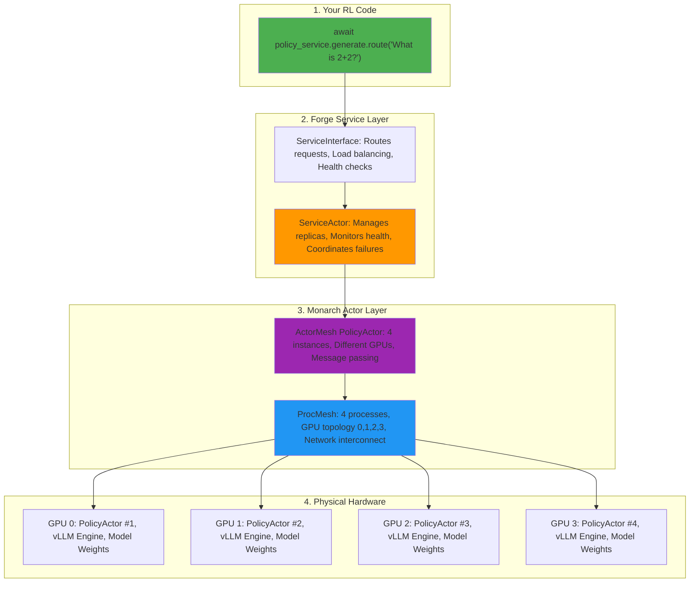
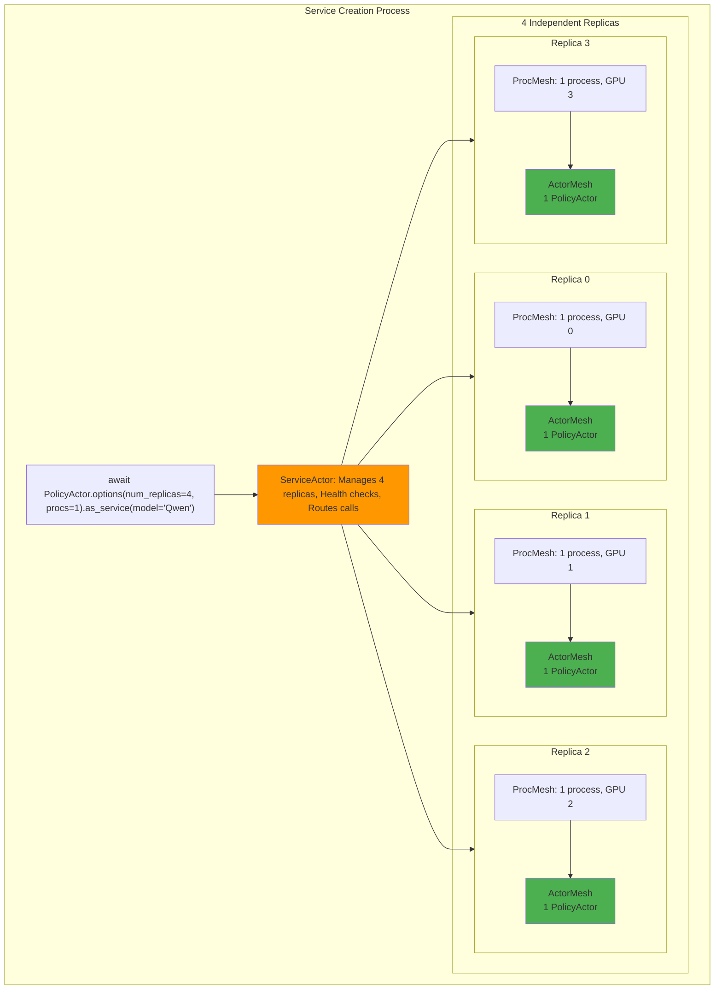
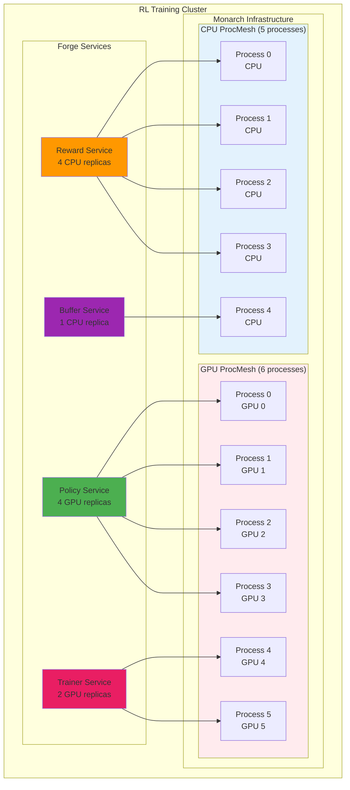

# Part 3: The Forge-Monarch Connection

This is part 3 of our series, in the previous sections: we learned Part 1: [RL Concepts and how they map to Forge](./1_RL_and_Forge_Fundamentals.MD), Part 2: [Forge Internals](./2_Forge_Internals.MD).

Now let's peel back the layers. Forge services are built on top of **Monarch**, PyTorch's distributed actor framework. Understanding this connection is crucial for optimization and debugging.

## The Complete Hierarchy: Service to Silicon



## Deep Dive: ProcMesh - The Foundation

**ProcMesh** is Monarch's core abstraction for organizing processes across hardware. Think of it as a multi-dimensional grid that maps directly to your cluster topology.

### Single Host ProcMesh

**Key insight**: ProcMesh creates one process per GPU, automatically handling the process-to-hardware mapping.

```python
# This simple call:
procs = this_host().spawn_procs(per_host={"gpus": 8})

# Creates:
# Process 0 → GPU 0
# Process 1 → GPU 1
# Process 2 → GPU 2
# Process 3 → GPU 3
# Process 4 → GPU 4
# Process 5 → GPU 5
# Process 6 → GPU 6
# Process 7 → GPU 7
```

The beauty: you don't manage individual processes or GPU assignments - ProcMesh handles the topology for you.

### Multi-Host ProcMesh

**Key insight**: ProcMesh seamlessly scales across multiple hosts with continuous process numbering.

```python
# Same simple API works across hosts:
cluster_procs = spawn_cluster_procs(
    hosts=["host1", "host2", "host3"],
    per_host={"gpus": 4}
)

# Automatically creates:
# Host 1: Processes 0-3  → GPUs 0-3
# Host 2: Processes 4-7  → GPUs 0-3
# Host 3: Processes 8-11 → GPUs 0-3

# Your code stays the same whether it's 1 host or 100 hosts
actors = cluster_procs.spawn("my_actor", MyActor)
```

**The power**: Scale from single host to cluster without changing your actor code - ProcMesh handles all the complexity.

```python
# This shows the underlying actor system that powers Forge services
# NOTE: This is for educational purposes - use ForgeActor and .as_service() in real Forge apps!

from monarch.actor import Actor, endpoint, this_proc, Future
from monarch.actor import ProcMesh, this_host
import asyncio

# STEP 1: Define a basic actor
class Counter(Actor):
    def __init__(self, initial_value: int):
        self.value = initial_value

    @endpoint
    def increment(self) -> None:
        self.value += 1

    @endpoint
    def get_value(self) -> int:
        return self.value

# STEP 2: Single actor in local process
counter: Counter = this_proc().spawn("counter", Counter, initial_value=0)

# STEP 3: Send messages
fut: Future[int] = counter.get_value.call_one()
value = await fut
print(f"Counter value: {value}")  # 0

# STEP 4: Multiple actors across processes
procs: ProcMesh = this_host().spawn_procs(per_host={"gpus": 8})
counters: Counter = procs.spawn("counters", Counter, 0)

# STEP 5: Broadcast to all actors
await counters.increment.call()

# STEP 6: Different message patterns
# call_one() - single actor
value = await counters.get_value.call_one()
print(f"One counter: {value}")  # Output: One counter: 1

# choose() - random single actor (actors only, not services)
value = await counters.get_value.choose()
print(f"Random counter: {value}")  # Output: Random counter: 1

# call() - all actors, collect results
values = await counters.get_value.call()
print(f"All counters: {values}")  # Output: All counters: [1, 1, 1, 1, 1, 1, 1, 1]

# broadcast() - fire and forget
await counters.increment.broadcast()  # No return value - just sends to all actors

# Cleanup
await procs.stop()

# Remember: This raw Monarch code is for understanding how Forge works internally.
# In your Forge applications, use ForgeActor, .as_service(), .as_actor() instead!
```

## Actor Meshes: Your Code Running Distributed

**ActorMesh** is created when you spawn actors across a ProcMesh. Key points:

- **One actor instance per process**: `mesh.spawn("policy", PolicyActor)` creates one PolicyActor in each process
- **Same constructor arguments**: All instances get the same initialization parameters
- **Independent state**: Each actor instance maintains its own state and memory
- **Message routing**: You can send messages to one actor or all actors using different methods

```python
# Simple example:
procs = spawn_procs(per_host={"gpus": 4})  # 4 processes
policy_actors = procs.spawn("policy", PolicyActor, model="Qwen/Qwen3-7B")

# Now you have 4 PolicyActor instances, one per GPU
# All initialized with the same model parameter
```

## How Forge Services Use Monarch

Now the key insight: **Forge services are ServiceActors that manage ActorMeshes of your ForgeActor replicas**.

### The Service Creation Process



### Service Call to Actor Execution

```mermaid
graph TD
    subgraph CallFlow["Complete Call Flow"]
        UserCall["await policy_service.generate.route('What is 2+2?')"]

        ServiceInterface["ServiceInterface: Receives .route() call, Routes to ServiceActor"]

        ServiceActor["ServiceActor: Selects healthy replica, Load balancing, Failure handling"]

        SelectedReplica["Selected Replica #2: ProcMesh 1 process, ActorMesh 1 PolicyActor"]

        PolicyActor["PolicyActor Instance: Loads model, Runs vLLM inference"]

        GPU["GPU 2: vLLM engine, Model weights, KV cache, CUDA kernels"]

        UserCall --> ServiceInterface
        ServiceInterface --> ServiceActor
        ServiceActor --> SelectedReplica
        SelectedReplica --> PolicyActor
        PolicyActor --> GPU

        GPU -.->|"Response"| PolicyActor
        PolicyActor -.->|"Response"| SelectedReplica
        SelectedReplica -.->|"Response"| ServiceActor
        ServiceActor -.->|"Response"| ServiceInterface
        ServiceInterface -.->|"'The answer is 4'"| UserCall
    end

    style UserCall fill:#4CAF50
    style ServiceActor fill:#FF9800
    style PolicyActor fill:#9C27B0
    style GPU fill:#FF5722
```



## Multiple Services Sharing Infrastructure

In real RL systems, you have multiple services that can share or use separate ProcMeshes:



## Key Insights: Why This Architecture Matters

1. **Process Isolation**: Each actor runs in its own process - failures don't cascade
2. **Location Transparency**: Actors can be local or remote with identical APIs
3. **Structured Distribution**: ProcMesh maps directly to hardware topology
4. **Message Passing**: No shared memory means no race conditions or locks
5. **Service Abstraction**: Forge hides Monarch complexity while preserving power

Understanding this hierarchy helps you:
- **Debug performance issues**: Is the bottleneck at service, actor, or hardware level?
- **Optimize resource usage**: How many replicas per service? GPU vs CPU processes?
- **Handle failures gracefully**: Which layer failed and how to recover?
- **Scale effectively**: Where to add resources for maximum impact?

# Conclusion

## What You've Learned

1. **RL Fundamentals**: How RL concepts map to Forge services with REAL, working examples
2. **Service Abstraction**: How to use Forge services effectively with verified communication patterns
3. **Monarch Foundation**: How Forge services connect to distributed actors and hardware

## Key Takeaways

- **Services hide complexity**: Your RL code looks like simple async functions, but runs on distributed clusters
- **Communication patterns matter**: `.route()`, `.fanout()`, sessions, and `.call_one()` each serve specific purposes
- **Architecture understanding helps**: Knowing the Service → Actor → Process → Hardware hierarchy helps you debug, optimize, and scale
- **Always verify APIs**: This guide is verified, but cross-check with source code for latest changes
- **Real API patterns**: Use `.options().as_service()` not `spawn_service()`, use `.route()` not `.choose()`, etc.
